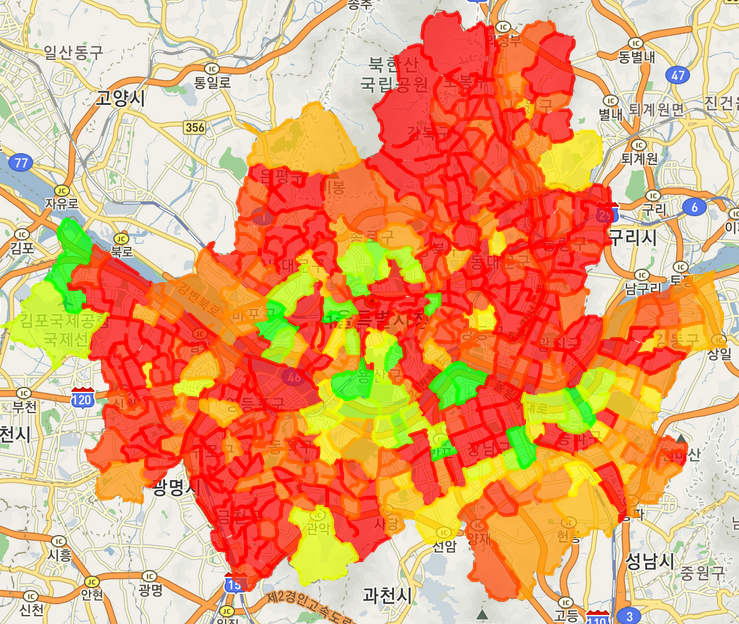
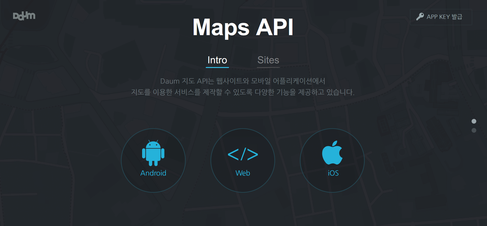

# Visualization
## 개요
Visualization은 Node.js와 다음 Map API를 이용한 웹 애플리케이션으로 제작하였다.

## Visualization 과정
### 1. 행정동 경계 데이터 입력
지도에 각 행정동을 다각형 형태로 표시하기 위해 행정 경계의 각 꼭짓점의 위경도 좌표가 저장된 데이터를 DB에 입력하였다.

https://github.com/vuski/admdongkor

위 저장소는 통계청 통계지리서비스에서 제공하는 행정동 경계 파일을 바탕으로 행정동 변경 이력을 수정하여 반영한 파일이다. 데이터는 geojson이라는 json 형식의 지형 표현 형식의 파일로 제공된다.

### 2. 점수 데이터 입력
Analysis 과정에서 분석된 평균 공시지가, 내국인 생활인구, 단기체류 외국인 생활인구, 숙박업소 호실 수, 추천 점수를 입력한다.

### 3. 다음 지도 API 사용

다음 지도 API의 Web API를 사용하여 입력된 데이터를 Visualization 한다. 해당 API는 Javascript로 제공되며, 행정동 경계 데이터를 통해 행정동의 형태를 표시하고, 점수 데이터를 통해 색상을 지정한다.